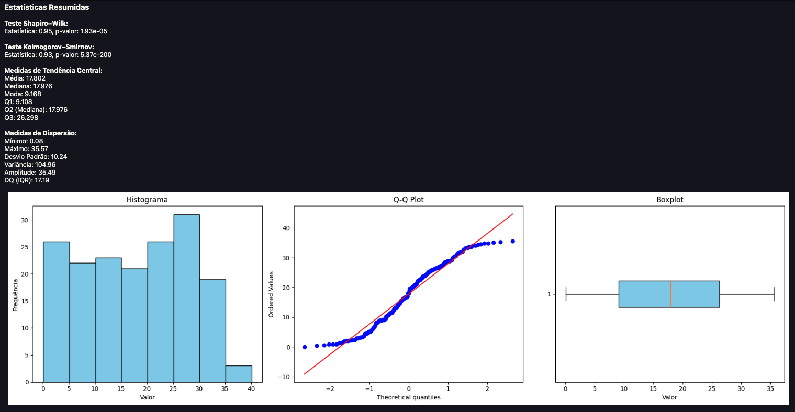
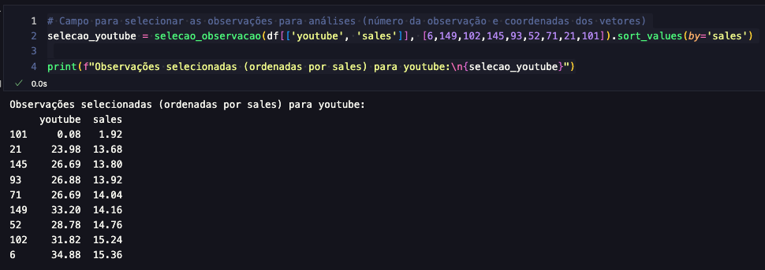
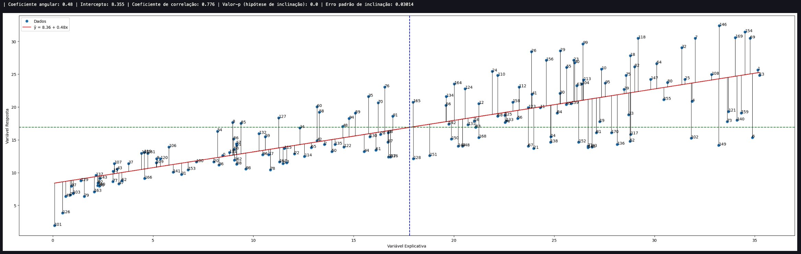
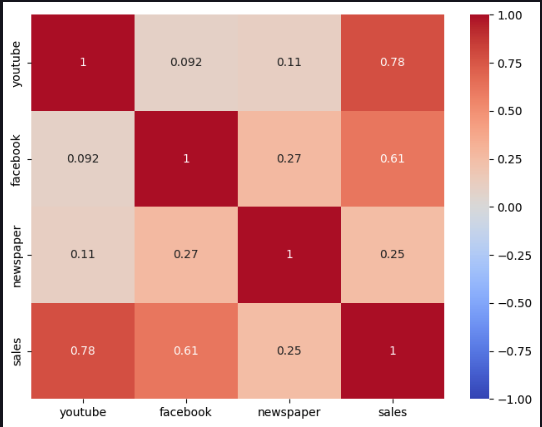
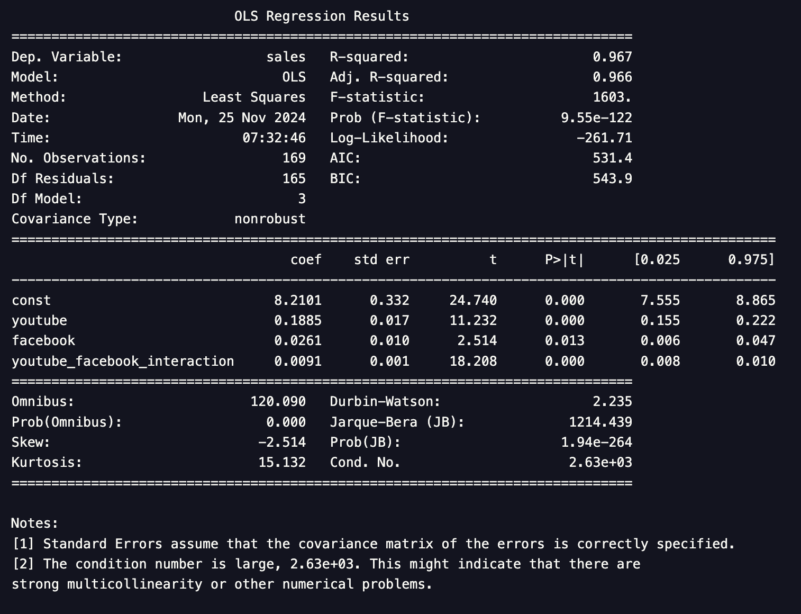
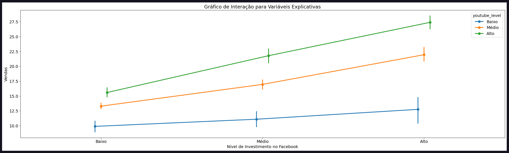
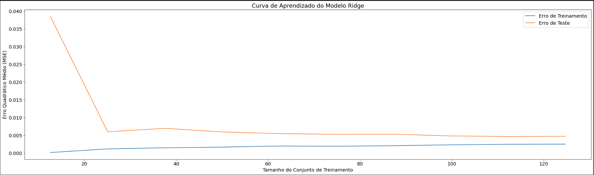

# 📊 Modelo Simples: Otimização de Variáveis com Base Estatística

Este projeto analisa dados de investimentos em marketing e seu impacto nas vendas, utilizando técnicas simples e diretas para criar um modelo preditivo e compreender as relações entre as variáveis. Inclui limpeza de dados, avaliação de métricas e análise exploratória, com foco na simplicidade da modelagem para extrair insights significativos. Além disso, técnicas como regularização com **Ridge Regression** e curvas de aprendizagem foram aplicadas, seguindo uma base sólida de conceitos estatísticos e teóricos.

---

## 📌 Objetivos do Projeto
1. Entender a relação entre os investimentos em diferentes plataformas de marketing (YouTube, Facebook e Newspaper) e o número de vendas geradas.
2. Identificar quais variáveis têm maior impacto no resultado.
3. Construir um modelo de regressão linear, incluindo técnicas de regularização para prever vendas com base nos investimentos em marketing.
4. Demonstrar a aplicação de fundamentos estatísticos e teóricos para embasar decisões analíticas.

---

## 📂 Estrutura do Projeto

### **1. Análise Exploratória dos Dados**
- Estatísticas descritivas para entender as distribuições individuais de cada variável, como média, mediana e dispersão.
- Verificação de correlações lineares entre as variáveis explicativas (`youtube`, `facebook`, `newspaper`) e a variável dependente (`sales`) para identificar relações diretas e independentes.
#### **Foram criadas funções e uma delas permitem avaliar as medidas resumo juntamente com gráficos para uma melhor assimilação e observação:**

### 📊 Medidas Resumo com Visualização Gráfica
As funções criadas ajudam a resumir e visualizar estatísticas descritivas, permitindo análises intuitivas e detalhadas.

#### 🔍 Estatísticas Resumidas


As estatísticas incluem:
- **Tendência Central:** Média, Mediana, Moda, Quantis.
- **Dispersão:** Desvio Padrão, Amplitude, Variância, IQR.
- **Testes de Normalidade:** Shapiro-Wilk e Kolmogorov-Smirnov.

---

#### 📉 **Descrição do Gráfico de Dispersão**
A função `grafico_dispersao` utiliza o método `stats.linregress()` da biblioteca **SciPy** para avaliar a relação linear entre duas variáveis. Ela calcula:

1. **Coeficiente Angular (Slope):** Inclinação da linha de regressão.
2. **Intercepto:** Valor da variável dependente quando a independente é zero.
3. **Coeficiente de Correlação (R):** Mede a força e direção da relação linear.
4. **Valor-p:** Testa a significância estatística da relação.
5. **Erro Padrão da Inclinação:** Quantifica a incerteza da estimativa.

#### ⚙️ **Adaptações no Gráfico**
- Resíduos representados por **linhas pretas verticais**, para avaliar **homocedasticidade**.
- **Numeração** das observações originais, destacando outliers ou valores atípicos.

#### 📊 **Exemplo Visual**
Os resíduos ajudam a verificar a constância da variância dos erros (homocedasticidade). 
Adicionalmente, a função `selecao_observacao` permite explorar os dados observados.

---

#### **Função Seleção e Gráfico**
- **Seleção de Coordenadas Observadas**
  

- **Gráfico com Resíduos e Coordenadas**
  

- **Mapas de calor para exibir correlações e identificar potenciais interações.**
 
 
 
  
# Análise de Interações entre Variáveis Explicativas

Explorou-se como os efeitos combinados das variáveis `youtube` e `facebook` podem influenciar as vendas de forma sinérgica ou antagônica. Para isso, foram adotadas as seguintes abordagens:

- **Criação de Termos de Interação**: No modelo foram incluídos termos como `youtube * facebook` para capturar possíveis efeitos conjuntos significativos.

- **Utilização de Gráficos de Perfis Médios**: Esses gráficos permitiram visualizar padrões de interação entre as variáveis, facilitando a identificação de como a combinação dos investimentos em `youtube` e `facebook` afeta as vendas.

## Sumário e Gráficos para Visualização

- **Sumário OLS**: A análise de regressão linear (OLS) foi realizada para avaliar a significância das interações entre as variáveis explicativas. Os resultados indicam que o termo de interação `youtube * facebook` é estatisticamente significativo, sugerindo que o efeito combinado dessas plataformas é relevante para as vendas.

  

- **Gráfico de Perfis Médios**: Este gráfico ilustra como diferentes níveis de investimento em `youtube` e `facebook` influenciam as vendas, destacando a natureza da interação entre essas variáveis.

  

Essas análises proporcionam uma compreensão mais profunda de como as estratégias de marketing digital podem ser otimizadas ao considerar os efeitos combinados das diferentes plataformas.


---

### **2. Modelagem**
- Construção inicial de um modelo de regressão linear utilizando variáveis explicativas para capturar relações diretas entre os investimentos em marketing (`youtube`, `facebook`, `newspaper`) e o retorno em vendas.
  - Realizado o método de **Mínimos Quadrados Ordinários (OLS)** para obter uma linha base, identificando o impacto direto de cada variável nas vendas e avaliando a significância estatística dos coeficientes.
- Expansão do modelo com **variáveis polinomiais**, permitindo capturar relações não lineares e interações entre os fatores explicativos. Esse enriquecimento do espaço de variáveis trouxe flexibilidade ao modelo para ajustar padrões complexos nos dados.
- **Ajuste de hiperparâmetros**:
  - Para a validação cruzada foi aplicado o método (k-fold) para selecionar os melhores valores do parâmetro de regularização (**alpha**) no contexto de **Ridge Regression**, garantindo que o modelo fosse robusto e menos suscetível a overfitting.
  - A validação cruzada avaliou múltiplas combinações de parâmetros, minimizando o erro médio quadrático em subconjuntos dos dados.
- Aplicação de **Ridge Regression**:
  - A técnica de regularização utilizada foi a L2 - Rigde - para reduzir o impacto da multicolinearidade, comum em dados de marketing, estabilizando os coeficientes do modelo.
  - O termo de penalidade controlou coeficientes extremos, resultando em maior generalização nas previsões.
- **Tratamento de heterocedasticidade**:
  - Os testes estatísticos para verificação de heterocedasticidade, como **Breusch-Pagan**, para detectar variâncias inconsistentes nos resíduos foram aplicados aos dados.
  - Implementaram-se transformações logarítmicas para estabilizar a variância nas variáveis explicativas e dependente, tornando os erros mais consistentes.
  - Quando necessário, foram feitos ajustes nos modelos ponderados (**Weighted Least Squares - WLS**) para lidar com a heterocedasticidade residual, atribuindo pesos inversamente proporcionais à variância observada.
- **Avaliação do modelo**:
  - O desempenho foi medido utilizando métricas como:
    - **R² ajustado**: Para avaliar a proporção da variância explicada pelo modelo.
    - **RMSE (Root Mean Square Error)**: Para medir a precisão das previsões.
    - **MAPE (Mean Absolute Percentage Error)**: Para medir o erro percentual médio das previsões em relação aos valores reais.
  - Foi realizado a análise dos resíduos para garantir a adequação do modelo e detectar padrões não capturados.

---

### **3. Curvas de Aprendizagem**
- Análise de desempenho do modelo a medida que o volume de dados aumenta.
- Identificação de possíveis melhorias na qualidade das previsões.


#### **Curva de Aprendizagem - Técnica Ridge**

---

### 📊 Interpretação dos Coeficientes do Modelo

Os coeficientes do modelo representam o impacto proporcional de cada variável no número de vendas, assumindo que todas as outras variáveis permanecem constantes. Os resultados do modelo Ridge indicam:

1. **Facebook**: O impacto direto de investir no Facebook é capturado pela variável `facebook`. Os termos quadráticos e cúbicos (`facebook_quadratico` e `facebook_cubico`) mostram como aumentos mais significativos no investimento podem ter efeitos não lineares.

2. **YouTube**: Investimentos no YouTube têm um impacto significativo nas vendas, como indicado pelos coeficientes das variáveis `youtube` e seus termos não lineares.

3. **Interações**:
   - O termo de interação `facebook_youtube_interacao` captura o efeito combinado de investir nas duas plataformas simultaneamente. Um coeficiente positivo para essa variável indica que os investimentos conjuntos em Facebook e YouTube têm um efeito sinérgico.

4. **Intercepto**:
   - O intercepto do modelo representa as vendas previstas quando todos os investimentos são zero.

#### 🔍 Coeficientes do Modelo
| Variável                     | Coeficiente      |
|------------------------------|------------------|
| facebook                     | 0.5174          |
| facebook_quadratico          | 0.0073          |
| facebook_cubico              | 0.0026          |
| youtube                      | 0.5800          |
| youtube_quadratico           | 0.0255          |
| youtube_cubico               | 0.2427          |
| facebook_youtube_interacao   | -0.1334         |
| **Intercepto**               | 0.2236          |

#### 🔑 Conclusão
- O **YouTube** apresenta o maior impacto direto entre as variáveis explicativas, seguido pelo **Facebook**.
- A interação entre **Facebook** e **YouTube** possui um efeito leve negativo, indicando que altos investimentos em ambas as plataformas podem não ser tão eficazes quando feitos simultaneamente.
- O intercepto sugere que as vendas esperadas, sem nenhum investimento, são aproximadamente 0.2236.

Os coeficientes foram salvos em um arquivo `coeficientes_ridge.csv` para referência futura.

---

## 🛠️ Tecnologias Utilizadas
- **Linguagem**: Python
- **Bibliotecas**:
  - `pandas` e `numpy`: Manipulação e análise de dados.
  - `matplotlib` e `seaborn`: Visualizações gráficas.
  - `statsmodels` e `sklearn`: Construção e avaliação do modelo, incluindo regularização com Ridge.

---

## 📈 Resultados
### Desempenho do Modelo Ridge (α=0.01)

- **R² (Treino)**: 99.71%
- **R² (Teste)**: 99.54%
- **MSE (Treino)**: 0.0025
- **MSE (Teste)**: 0.0047
- **Validação Cruzada**:
  - R² Médio (K-Fold): **99.60% (±0.0014)**
  - MSE Médio (K-Fold): **0.0033 (±0.0011)**

### Métricas Adicionais
- **Log-Likelihood**:
  - Treino: **198.63**
  - Teste: **40.30**
- **AIC** (Akaike Information Criterion):
  - Treino: **-381.27**
  - Teste: **-64.60**
- **BIC** (Bayesian Information Criterion):
  - Treino: **-358.58**
  - Teste: **-52.87**

### Análise
- O modelo apresentou excelente capacidade de explicação dos dados, com valores de **R² elevados tanto no conjunto de treino quanto no conjunto de teste**.
- A diferença mínima de **0.17% no R²** entre treino e teste demonstra que o modelo está bem ajustado, sem sinais de overfitting ou underfitting.
- As métricas de validação cruzada confirmam a **robustez e consistência do modelo** em diferentes subconjuntos de dados.
- Métricas como AIC e BIC reforçam a eficiência do modelo ao penalizar a complexidade sem sacrificar o desempenho.


---

## 📝 Como Reproduzir
1. Clone este repositório:
   ```bash
   git clone https://github.com/RodrigoCamposDS/modelo-regressao-simples.git
   cd modelo-regressao-simples


